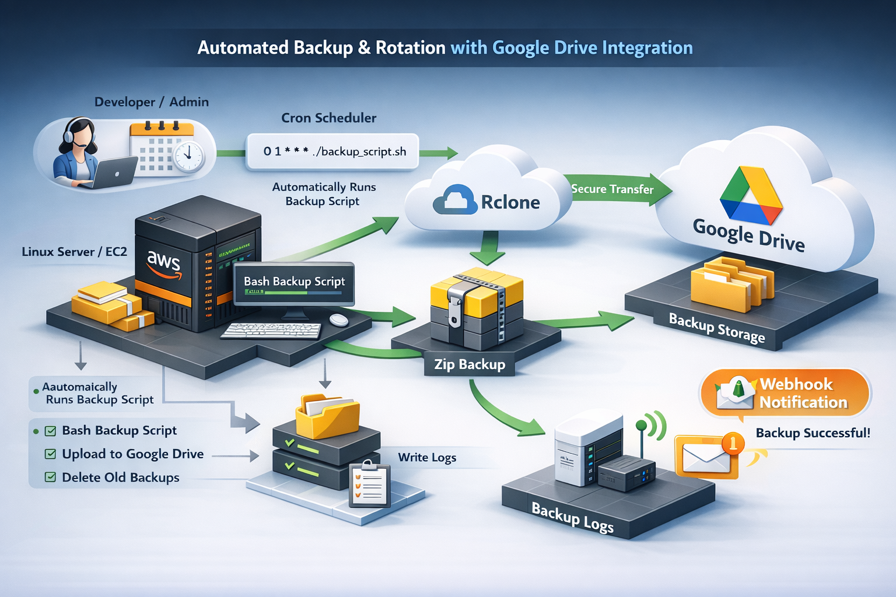
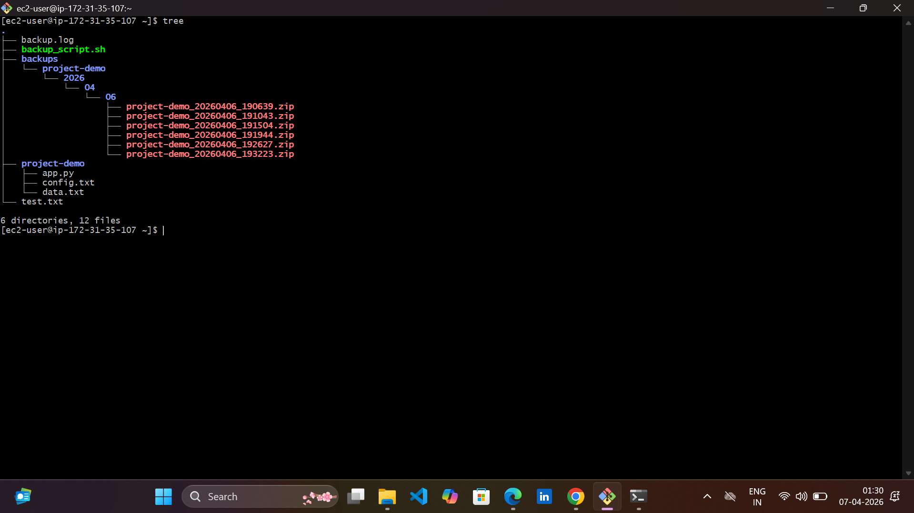
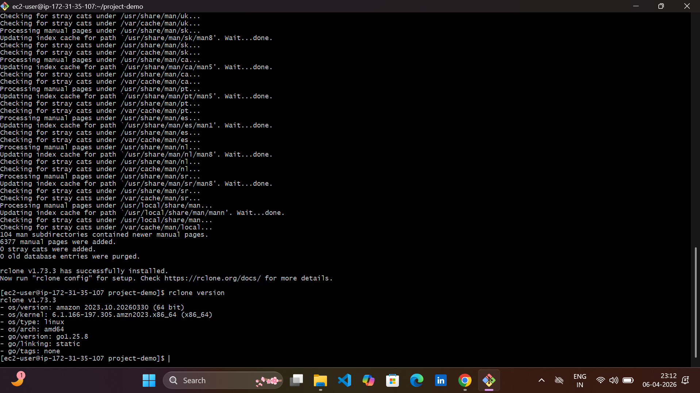
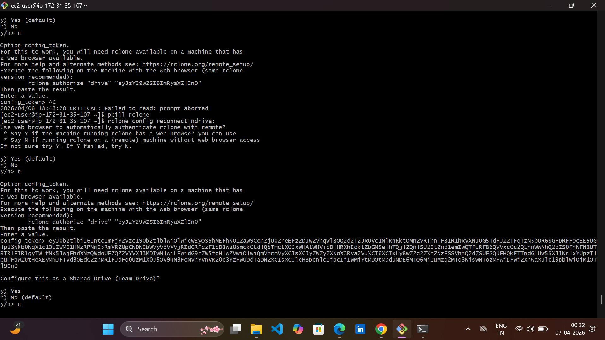
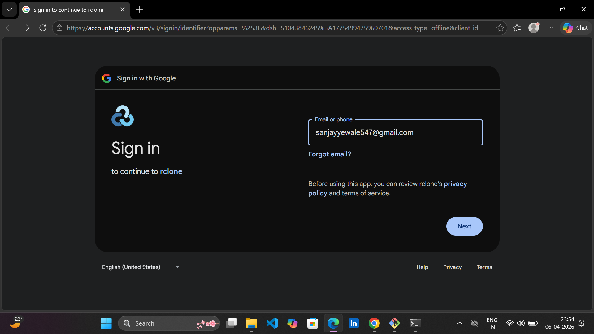
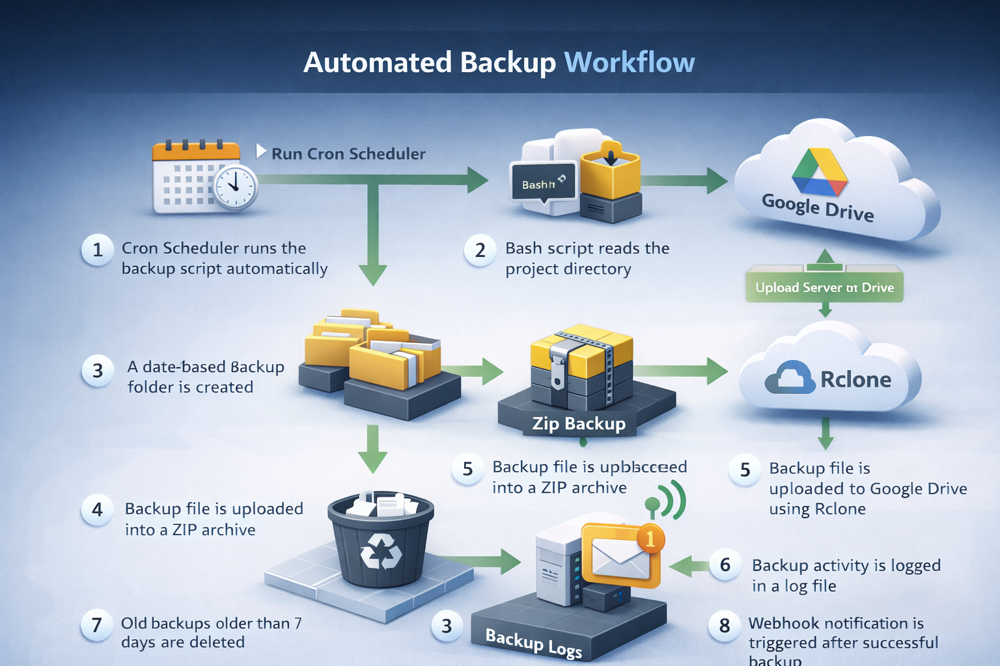
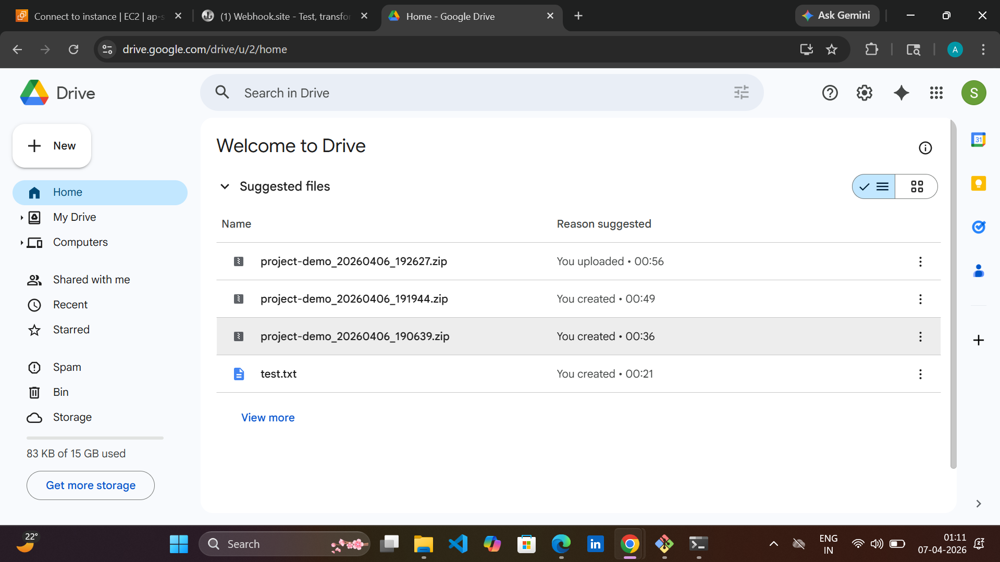
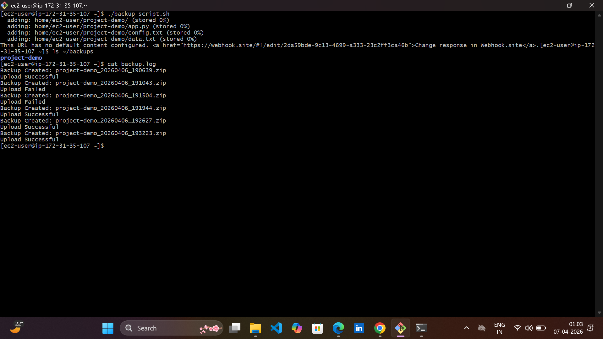
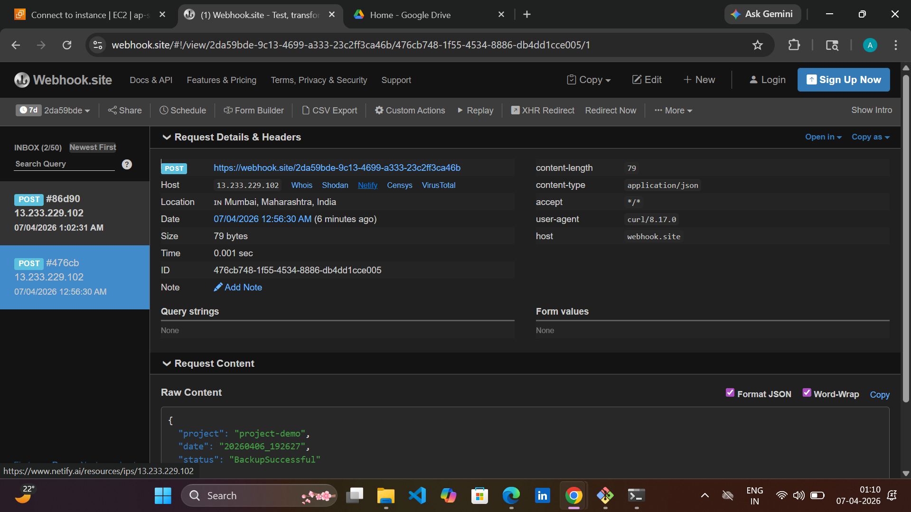
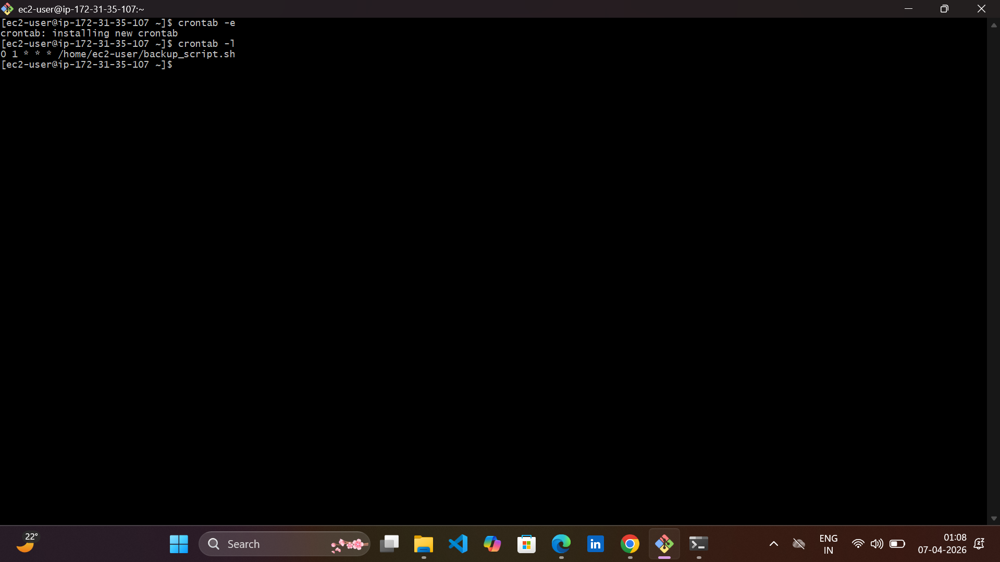

# Automated Backup and Rotation Script with Google Drive Integration

Automated Backup and Rotation Script with Google Drive Integration is a DevOps project that demonstrates how to automate backups of application files on a Linux server and store them securely in Google Drive using Rclone.

The project creates compressed backups of application files, uploads them to cloud storage, logs the backup activity, automatically deletes old backups, and sends webhook notifications after successful backup execution.

This project simulates a real-world infrastructure scenario where application data must be backed up regularly to prevent data loss.

---

## Technologies Used

- Linux (EC2 / Ubuntu / Amazon Linux)
- Bash Shell Scripting
- Rclone
- Google Drive
- Cron Jobs
- Zip Utility
- Webhook Notifications

---
## Architecture Diagram



### Architecture Flow

1. Cron Scheduler triggers the backup script automatically.
2. Bash script compresses application files into a ZIP archive.
3. Backup file is stored in a structured local directory.
4. Rclone uploads the backup file to Google Drive.
5. Logs are written to a log file.
6. Old backups older than 7 days are deleted.
7. Webhook notification is triggered after backup completion.

---

## Project Structure

```
project-backup-automation
│
├── project-demo
│   ├── app.py
│   ├── config.txt
│   └── data.txt
│
├── backup_script.sh
├── backup.log
├── README.md
│
└── images
    ├── architecture.png
    ├── workflow.png
    ├── webhook-notification.png
    ├── google-drive-backup.png
    └── cron.png
```

---
## Rclone Installation

Rclone is used to connect the Linux server with Google Drive so backup files can be uploaded automatically to cloud storage.

Install Rclone:

```bash
curl https://rclone.org/install.sh | sudo bash
```

Verify installation:

```bash
rclone version
```

---

## Rclone Configuration

After installing Rclone, configure it to connect with Google Drive.

Start configuration:

```bash
rclone config
```

Follow these steps:

1. Type **n** to create a new remote
2. Enter remote name (example: `ndrive`)
3. Select **Google Drive**
4. Press **Enter** for client ID
5. Press **Enter** for client secret
6. Select **Full Access**
7. Choose **Auto config**
8. Login with your Google account
9. Allow permissions
10. Confirm configuration

Verify connection:

```bash
rclone lsd ndrive:
```

Create backup folder in Google Drive:

```bash
rclone mkdir ndrive:ProjectBackups
```

Test upload:

```bash
rclone copy test.zip ndrive:ProjectBackups
```





---


## Sample Application

Example `app.py` used in the project:

```python
print("Project Demo Application Running")

config_file = open("config.txt","r")
data_file = open("data.txt","r")

print("Configuration:")
print(config_file.read())

print("Data:")
print(data_file.read())

config_file.close()
data_file.close()
```

---

## Backup Script

```bash
#!/bin/bash

PROJECT_NAME="project-demo"
PROJECT_DIR="/home/ec2-user/project-demo"

BACKUP_BASE="/home/ec2-user/backups"

DATE=$(date +"%Y%m%d_%H%M%S")

YEAR=$(date +"%Y")
MONTH=$(date +"%m")
DAY=$(date +"%d")

BACKUP_DIR="$BACKUP_BASE/$PROJECT_NAME/$YEAR/$MONTH/$DAY"

LOG_FILE="/home/ec2-user/backup.log"

NOTIFY=true

mkdir -p $BACKUP_DIR

ZIP_NAME="${PROJECT_NAME}_${DATE}.zip"

zip -r $BACKUP_DIR/$ZIP_NAME $PROJECT_DIR

echo "Backup Created: $ZIP_NAME" >> $LOG_FILE

# Upload to Google Drive
rclone copy $BACKUP_DIR/$ZIP_NAME ndrive:ProjectBackups

if [ $? -eq 0 ]
then
    echo "Upload Successful" >> $LOG_FILE

    if [ "$NOTIFY" = true ]; then

    curl -X POST -H "Content-Type: application/json" \
    -d "{\"project\":\"$PROJECT_NAME\",\"date\":\"$DATE\",\"status\":\"BackupSuccessful\"}" \
    https://webhook.site/your-webhook-url

    fi

else
    echo "Upload Failed" >> $LOG_FILE
fi

# Delete backups older than 7 days
find /home/ec2-user/backups/project-demo -type f -mtime +7 -delete
```

---

## Backup Workflow



### Workflow Steps

1. Cron scheduler runs the backup script.
2. Script reads the project directory.
3. Backup directory is created automatically.
4. Files are compressed into a ZIP archive.
5. Backup file is uploaded to Google Drive using Rclone.
6. Backup logs are stored.
7. Old backups older than 7 days are deleted.
8. Webhook notification is triggered.

---

## Google Drive Backup



All backup files are automatically uploaded and stored in Google Drive using Rclone.

---

## Backup Log Output

Example log output:

```
Backup Created: project-demo_20260406_193223.zip
Upload Successful
```

Logs help track backup activity and troubleshoot failures.


---

## Webhook Notification

Webhook notifications are used to send alerts when the backup is completed successfully.

Example webhook payload:

```json
{
 "project":"project-demo",
 "date":"20260406_192627",
 "status":"BackupSuccessful"
}
```

---

## Automating Backup with Cron

Open cron editor:

```bash
crontab -e
```

Add the following job to run backup daily at 1 AM:

```bash
0 1 * * * /home/ec2-user/backup_script.sh
```

Verify cron jobs:

```bash
crontab -l
```

---

## Features

- Automated backup creation
- Google Drive cloud backup
- Backup rotation (delete old backups)
- Cron job automation
- Webhook notifications
- Backup logging

---

## Author

Aniket Yewale  
Cloud & DevOps Enthusiast